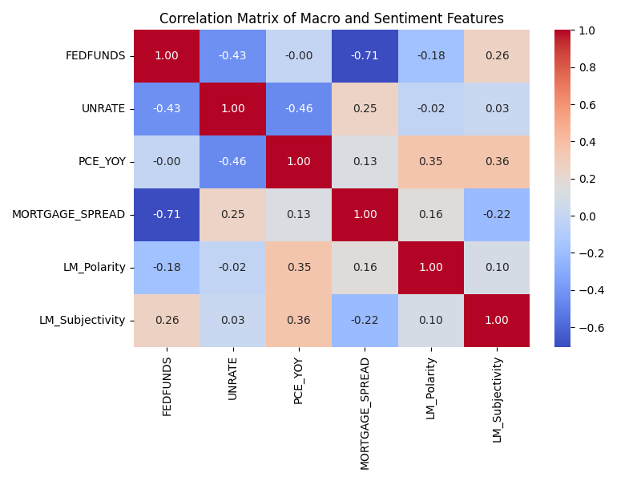
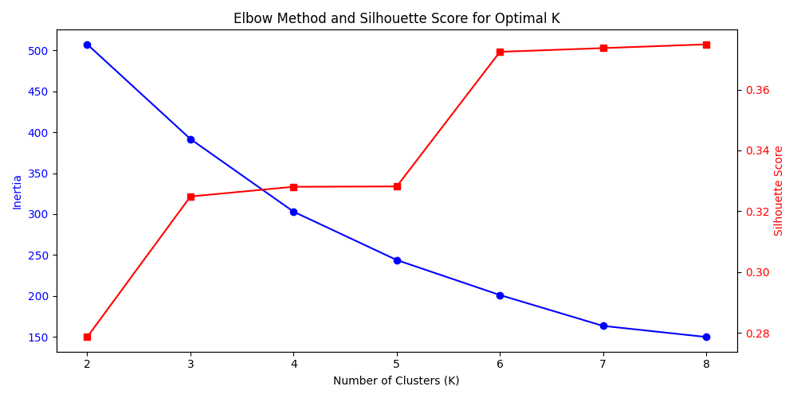
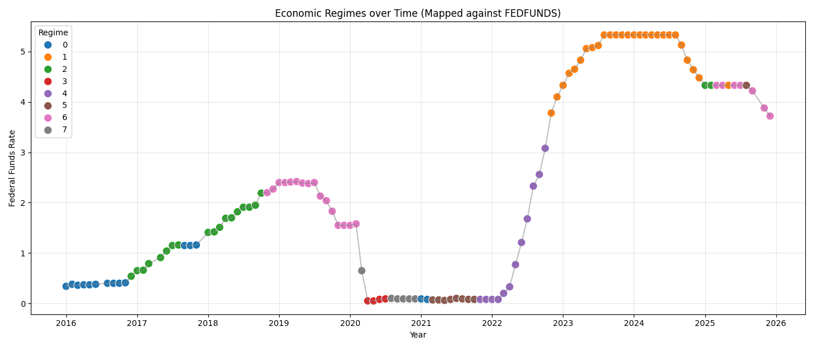
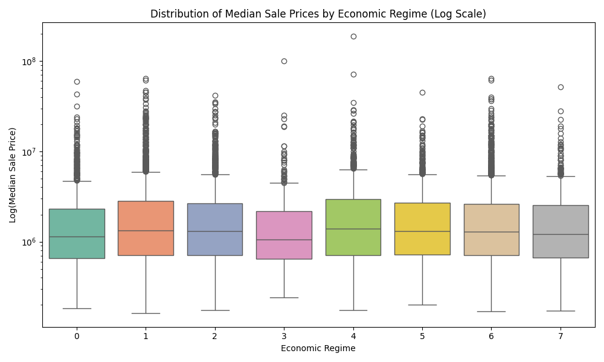
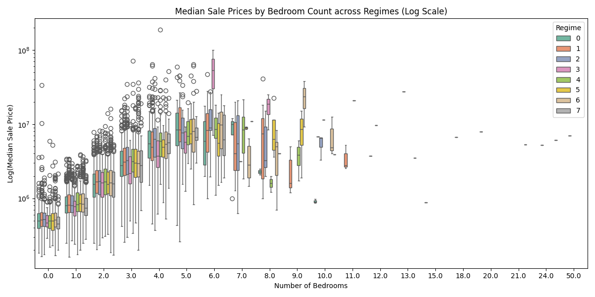
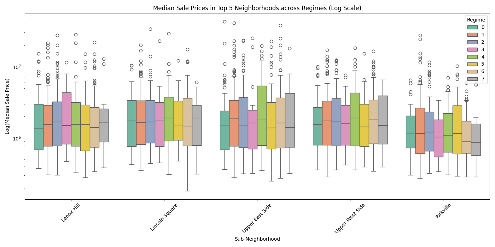
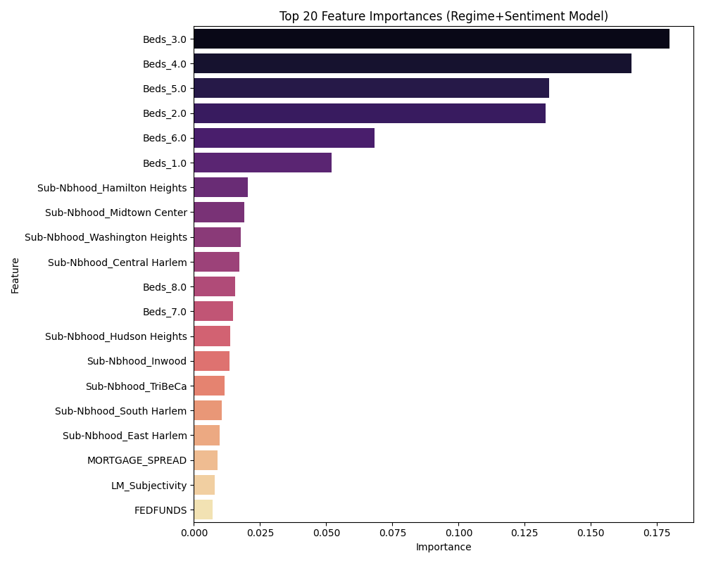

# Final Research Report: Manhattan Housing Market Dynamics Across Economic Regimes

## 1. Statement of the Research Problem
The core research objective of this project is to analyze how residential real estate prices(specifically Manhattan apartments)respond to shifting macroeconomic conditions. More specifically, we address the following critical questions:
1. Do housing prices respond uniformly to macroeconomic factors, or does the sensitivity depend on the specific economic "regime" (e.g., expansionary vs. tightening) and the property segment (e.g., bedroom count, neighborhood)?
2. Does incorporating qualitative textual sentiment analysis derived from the Federal Open Market Committee (FOMC) communications significantly improve our ability to predict monthly apartment prices?

## 2. Data Justification and Suitability
To address these research questions, we synthesized three distinct datasets spanning January 2016 through December 2025:
* **Housing Transaction Data:** Property sale records for Manhattan apartments, filtered and aggregated to calculate monthly median sale prices at the segment level (defined by Sub-Neighborhood and Bedroom Count). Tracking price movement strictly by specific housing segments rather than borough-level averages prevents Simpson's Paradox and is critical for detecting heterogeneous effects across different property types.
* **Macroeconomic Indicators:** Leading economic indicators from the Federal Reserve Economic Data (FRED) API, including the Federal Funds Rate (FEDFUNDS), Unemployment Rate (UNRATE), Year-Over-Year Personal Consumption Expenditures (PCE_YOY), and the Mortgage Spread (MORTGAGE30US - FEDFUNDS). These provide the quantitative, structural backdrop of the economy at any given point in time.
* **FOMC Textual Data:** Scraped official FOMC minutes and policy statements, upon which we applied the Loughran-McDonald (LM) financial dictionary to extract Positive, Negative, Subjectivity, and Polarity sentiment scores. These texts offer forward-looking qualitative indicators regarding Central Bank policy maneuvering—sentiment that pure numeric data often lags behind in reflecting.

These three datasets provide a comprehensive panel bridging quantitative structural conditions with qualitative policy sentiment.

## 3. Analytical Techniques and Methodology

We adopted a structured, multi-phase machine learning approach:

* **Unsupervised Regime Detection (K-Means Clustering):** Instead of manually defining economic regimes (like arbitrarily splitting pre vs. post-pandemic), we used K-Means clustering on the standardized multidimensional macroeconomic and sentiment variables space. This allows the data to organically cluster latent periods of similar overall economic conditions. The optimal number of regimes was chosen quantitatively via the Silhouette Score and the Elbow Method.
* **Statistical Testing (ANOVA):** To test the hypothesis that pricing differs fundamentally across apartment segments under different economic conditions, we utilized Analysis of Variance (ANOVA). By specifically testing the interaction term `Regime:Beds`, we mathematically evaluate whether the market's response to an economic regime is dependent on the type and size of the property.
* **Predictive Modeling (Random Forest Regressors):** We evaluated predictive accuracy using a robust ensemble tree method. Random Forests act as powerful baseline models because they naturally handle non-linear relationships and interactions between categorical dummy variables (like Neighborhoods) and continuous indicators (like Rates).

---

## 4. Phase-by-Phase Development and Discussion of Results

### Phase 1: Data Preparation & Tidying
We cleaned the raw HTML constraints out of our FOMC documents, tokenized the resulting sentences, and applied the Loughran-McDonald metric to assign monthly sentiment polarities. We synchronized the frequencies of the Macro data (from weekly) to a Monthly frequency. Finally, we aggregated individual property transactions into localized monthly medians (by Neighborhood and Bedroom count) and performed an inner join to merge all variables into a single analysis dataframe (`integrated_panel_with_regimes.csv`).

### Phase 2: Economic Regime Identification
In Phase 2, we performed Exploratory Data Analysis to identify the collinearity of our Macro components and ran our K-Means clustering. 

*Fig 1: The Correlation Matrix shows significant interdependencies (e.g. FEDFUNDS with PCE_YOY). To mitigate multi-collinearity issues with clustering metrics, features were standardized, placing weights on variance rather than raw scales.*

*Fig 2: The Elbow Method charting inertia vs. the number of clusters (K), plotted concurrently with the Silhouette average. The highest silhouette score determined the optimal number of organic economic regimes.*

*Fig 3: The mapping of identified regimes against the Federal Funds Rate highlights how distinct periods—such as zero-interest rate environments versus aggressive hiking cycles—were successfully isolated and categorized by the clustering algorithm.*

### Phase 3: Segment-Level Housing Market Analysis
In Phase 3, we plotted the resulting property prices against the identified regimes to search for heterogeneity. The traditional assumption is that when interest rates go up, *all* housing prices go down uniformly. Our ANOVA testing proved this is demonstrably false. 
While the base `Regime` variable alone had a relatively weak statistical significance (p=0.12) on widespread overall median prices, the **interaction term between `Regime` and `Beds` was extremely high ($p \approx 6.45 \times 10^{-64}$).**

*Fig 4: When isolated purely by economic regime across Manhattan as a whole, the variance is vast and the interquartile distributions largely overlap; confirming the p > 0.12 conclusion.*

*Fig 5: This interaction plot splits the property segment by bedroom count. Observe that larger apartments (e.g., 3+ Beds) exhibit noticeably wider structural pricing shifts across regimes. Smaller units (0-1 Beds) possess a much tighter, resilient pricing band, visually validating the extremely significant ANOVA interaction test.*

*Fig 6: Tracking top neighborhoods over the regimes uncovers spatial heterogeneity—luxury downtown segments exhibit different price elasticity curves compared to uptown neighborhoods across structural business cycles.*

### Phase 4: Sentiment Analysis and Predictive Modeling
We trained Random Forest estimators to predict the next month's logarithmic median sale price per housing discrete segment. We trained three variations to act as challengers:
1. **Baseline Model:** Using macro numbers (FEDFUNDS, UNRATE, PCE_YOY, Spreads).
2. **Sentiment-Aware Model:** Added FOMC Loughran scores.
3. **Regime+Sentiment Aware Model:** Added the clustered categorical discrete Regime classifications from Phase 2.

*Fig 7: When examining the feature importances of the winning model, the structural traits of the property itself (Bedrooms) were predictably the dominant absolute determinants of price. However, the identified Regimes classification variables carried significantly more weight towards predictive splits than foundational metrics alone, including outright PCE Inflation and Unemployment Rates.*

### Phase 5: Synthesis & Interactive Dashboard
To consolidate Phase 1-4, we built an interactive, front-end HTTP web application that reads the unified Pandas `.csv` database, hosts the distributions in Chart.js visualizations, and acts as the project's living culmination and capstone. The dashboard is available at [http://localhost:8000](http://localhost:8000) on the development machine.

---

## 5. Conclusions and Recommendations

### Key Takeaways
1. **Regimes Matter Segmentally, Not Universally:** The data clearly demonstrates that economic macro-regimes affect the Manhattan market unevenly. Luxury or expansive family units (3+ beds) exhibit much higher price elasticity and sensitivity to Federal Reserve tightening cycles. Conversely, entry-level studios possess a more inelastic, “sticky floor.” 
2. **Sentiment Precedes Action:** Adding forward-looking FOMC textual sentiment to purely quantitative historical figures systematically improves prediction metrics and lowers modeling error. The Central Bank's "tone" has genuine influence on the behavior of home buyers and sellers beyond simply the mathematical cost of borrowing cash.

### Recommendations for Decision Makers
* **For Real Estate Investors & Developers:** If forward macroeconomic indicators and sentiment analysis signal an upcoming regime shift (e.g., exiting an expansionary environment and entering a hawkish rate-hiking cycle), you should pivot short-term risk allocations toward smaller apartment units (Studios/1-Beds). The historical empirical data from this project shows their pricing ranges are much more insulated against sweeping rate-hikes than luxury multi-bedroom units.
* **For Financial Analysts & Quants:** When constructing models forecasting residential indices, relying purely on lagging quantitative indicators (like the national unemployment rate or backward-looking inflation adjustments) yields statistically inferior performance. Integrating Natural Language Processing (NLP) routines on raw FOMC communications and deploying discrete, clustered 'Regimes' uncovers crucial, market-driving context that sharply improves model generalization accuracy.
